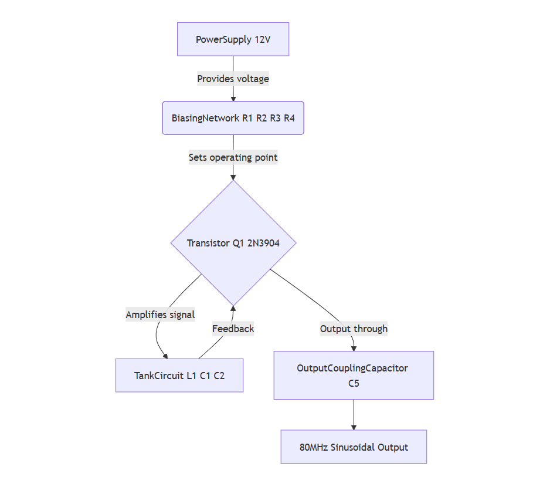
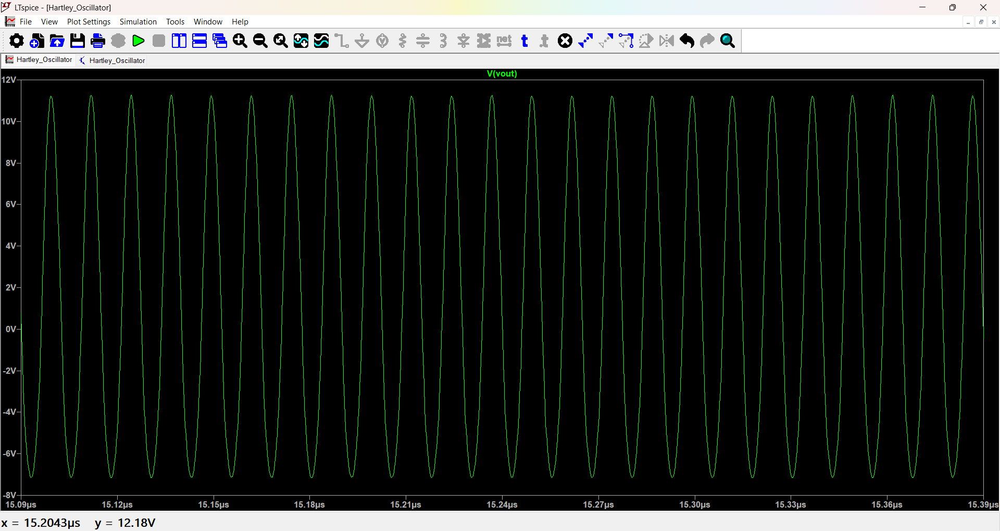
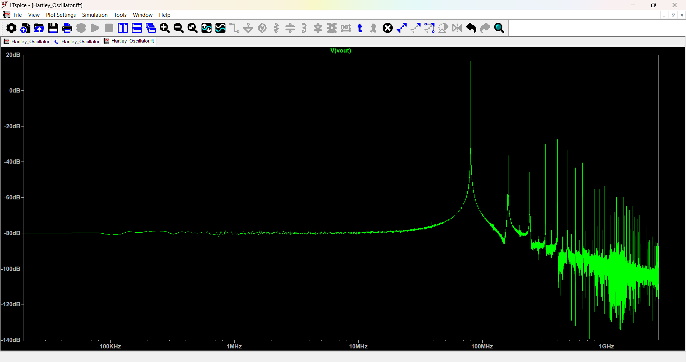

# ⚙️ 80 MHz Hartley Oscillator Design and Simulation

---

## 📌Introduction
This project involves designing, simulating, and prototyping an 80 MHz Hartley oscillator. The circuit uses a 2N3904 NPN bipolar junction transistor along with a tank circuit composed of inductors and capacitors to generate a stable sinusoidal waveform. The oscillator is useful for RF signal generation and other high-frequency applications.

---

## 📈Features
- Generates a clean sinusoidal output at 80 MHz frequency  
- Utilizes a 2N3904 NPN transistor as the amplifying device  
- Tank circuit formed with precise inductors and capacitors for frequency control  
- Verified through both hardware prototyping and LTspice simulation  
- Designed for stability and accuracy in output waveform  

---

## Block Diagram
<!-- Replace with your block diagram image -->

  

                                   *Figure 1: Hartley Oscillator Block Diagram*

---

## Circuit Diagram

  

  
                                       *Figure 2: Hartley Oscillator LTspice Schematic*

---

## Components List

| Component | Value    | Description                        |
| --------- | -------- | -------------------------------- |
| Q1        | 2N3904   | NPN Bipolar Junction Transistor  |
| R1        | 120 Ω    | Emitter resistor                  |
| R2        | 1 kΩ     | Base bias resistor                |
| R3        | 6.8 kΩ   | Collector bias resistor           |
| R4        | 820 Ω    | Collector load resistor           |
| C1        | 10 pF    | Tank capacitor                   |
| C2        | 30 pF    | Tank capacitor                   |
| C3        | 10 nF    | Emitter bypass capacitor          |
| C4        | 10 pF    | Coupling capacitor                |
| C5        | 10 pF    | Output coupling capacitor         |
| L1        | 0.40 μH  | Tank inductor                    |
| V1        | 12 V     | DC Power Supply                  |

---

## Simulation Setup

- **Software:** LTspice  
- **Simulation Type:** Transient analysis  
- **Parameters:**  
  - Simulation time: 200 μs  
  - Time step: 0.25 ns  
  - Startup enabled  

---

## Results

- The simulation produced a stable sinusoidal waveform at approximately 80 MHz frequency.  
- The output voltage was consistent with expected amplitude and frequency stability, confirming design accuracy.  

<!-- You can add waveform screenshots here -->

  

  

                                                  *Figure 3: Output waveform from LTspice simulation*

---

## Usage Instructions

1. Open the LTspice schematic file included in the repository.  
2. Run transient simulation using the specified parameters.  
3. Observe the output node labeled `Vout` to confirm oscillations at 80 MHz.  
4. For hardware implementation, assemble the circuit using the listed components and test on a breadboard or PCB.  
5. Adjust component values as needed to fine-tune frequency or signal quality.

---

---

